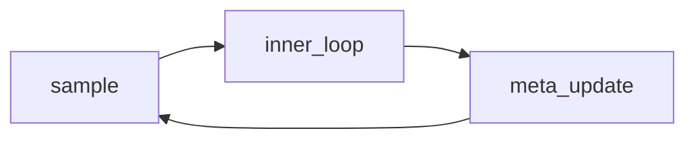

# GAE and inner-loop adaptation

The GAE lambda interacts badly with inner-loop adaptation. Inline $\lambda = 0.95$ and display:

$$A_t = \sum_{l=0}^{\infty} (\gamma\lambda)^l \delta_{t+l}$$

| step | note               |
| ---- | ------------------ |
| 1    | pin the tokenizer  |
| 2    | measure worst case |

- pin `unicode61 remove_diacritics 2`
- measure the worst case
