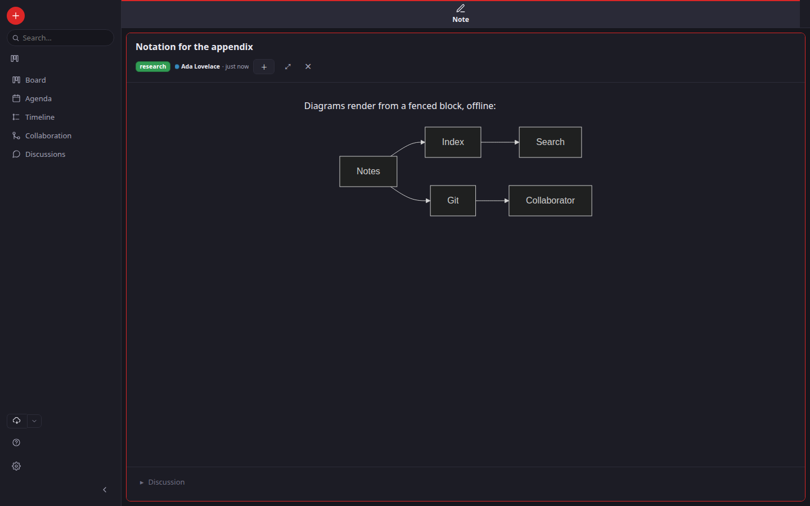

# Assets & media

Assets — images, PDFs, video, audio, any file — are stored once as
**content-addressed blobs** (keyed by the SHA-256 of their bytes) and referenced
from notes. Identical files are stored once; the hash *is* the identity.

## Adding an asset while writing

In a note's editor you have two fast paths:

- **Drag a file in.** Drop it onto the editor; formicaria ingests it (hashing,
  MIME sniffing, text extraction) and inserts a reference at your
  cursor.
- **Type `/`.** A menu opens at your cursor listing your **most recent notes**;
  keep typing to search by name (and extracted text) across everything. The
  search covers **notes and assets together** and labels each with its type — see
  [Linking notes](./notes.md#linking-notes-together). Assets appear once you type
  a query, which is also the only place they show up: they get no card of their
  own in the Board, Agenda or Timeline.

Both insert a Markdown image reference like:

```markdown

```

You can also ingest from the command line: `fm add path/to/file.pdf`.

### On the phone, there is no longer a size limit

Attaching used to stop at 16 MB on Android, which refused most video. The limit was never about
what a sensible attachment weighs — the phone can only carry a file to the app as text, and a
whole file encoded that way stops fitting in memory. Since 2026-09-04 a large file is **sent in
slices** instead, so only one slice is in flight at a time and the file's own size stops
mattering. Small files still go in one piece, which is quicker.

**What has not changed is where those bytes live.** A phone vault is the app's private storage:
Android erases it when the app is uninstalled, and a git push carries your notes but *not* their
media. So a video attached on a phone has exactly one copy until it reaches a computer that can
snapshot it. The app says so in Settings, and it is worth believing before trusting a phone with
the only copy of something.

## How media renders

In the read view, a referenced asset renders with the native browser element for
its type:

Maths and diagrams render the same way, from the note's own text and with no network access:



- **Images** — inline.
- **PDFs** — a scrollable, multi-page inline viewer (the browser's own) — **on the desktop
  only**. Android's WebView cannot draw a PDF inline, so on the phone a PDF is a link that
  opens in whatever app the phone uses for PDFs.
- **Video / audio** — with native playback controls.
- **Anything else** — a labelled link to open it.

If the blob isn't present (e.g. a fresh clone before the media has synced), the
reference degrades to a small **"not available"** placeholder — media absence is
a warning, never a broken page. The extracted text of a PDF travels with the
note (in git), so a paper is searchable even before its blob arrives.

## Where blobs live

Blobs are written under `vault/blobs/` and are **git-ignored** — they sync
out-of-band (backup / a file-sync tool), keeping the notes repository small and
clonable.
