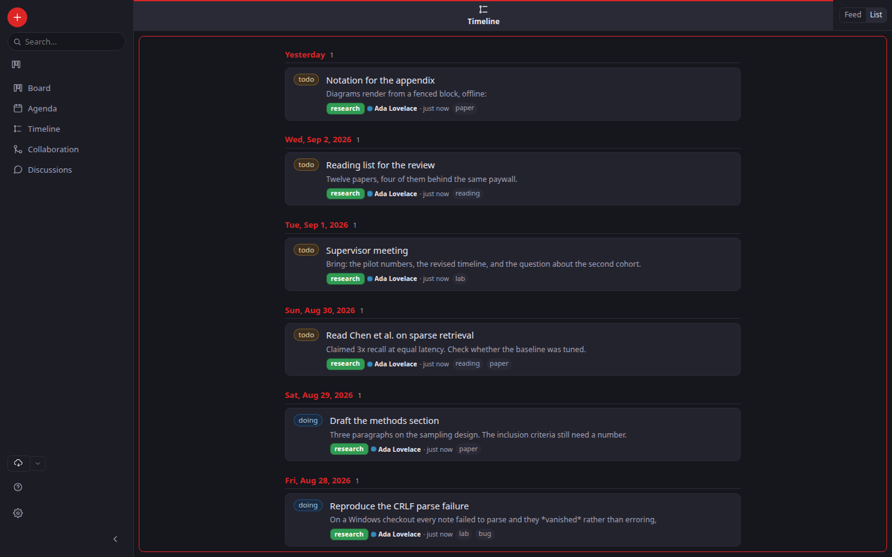

# Views

Every view is the same data seen a different way — "a query plus a renderer".
Open a view into a **pane** from the sidebar — down the left of a wide window, along the bottom of
a narrow one; each pane has its own picker, so several
views can be on screen at once, side by side.


- **Board** — a Kanban board, grouped by `status`. It can group by any property
  (project, tags, or a custom key) — but that is chosen in a saved view's file,
  `group_by:`, not from a control on screen; see [Saved views](#saved-views).
  Drag a card to a column to set that
  property; the change writes straight back to the note's frontmatter. Drop it
  **where you want it** in the column — cards stay in the order you arrange them,
  which is remembered in this browser rather than written to your notes. Drag a
  column header to reorder the columns the same way.
- **Agenda** — dated, unfinished items. Three layouts via the sub-toggle:
  - **Month** — a calendar grid; items land on their due day, tinted by urgency
    (overdue / soon / this week / later), hard deadlines marked ◆.
  - **Week** — a denser single-week grid.
  - **List** — a sorted, soonest-first list.

  
- **Timeline** — a journal: every note grouped under the day it was created,
  newest first.
- **Collaboration** — the open [proposals](./collaboration.md#proposals) across
  your vaults: notes that propose a change to a git branch, newest first. Open one
  to read it and its discussion. (Conflicts awaiting resolution are surfaced by the
  backup panel, not here.)
- **Discussions** — every discussion across your vaults in one place, so a thread
  you replied to last week is not lost inside the note it hangs off.

Two more are real views but are **not** in the sidebar, and that is deliberate:

- **Activity** — who changed what, and when, read straight out of each vault's git
  log. Nothing is stored for it: git already knows, so this is a view of history
  rather than a record of its own. It is genuinely useful and genuinely rare, so it
  lives in the **command palette** rather than costing a permanent row of attention.
  It is *not* the same as the Timeline: the Timeline is your notes by the day you
  wrote them; Activity is every edit, including other people's.

  
- **Search** — full-text search across every note (and the extracted text of
  ingested PDFs). Reached by typing into the **search box** at the top of the
  sidebar, never from the list: clicking an empty search view produces a blank pane,
  so there is nothing to click.

The Board, Agenda and Timeline show **notes only** — which excludes three kinds of
note that are not things you plan. An [asset](./assets.md) is a file a note refers
to, so it never gets a card of its own — open one from the note that references it.
A **discussion message** (a reply, see [Notes](./notes.md#discussion)) belongs to
the note it is about, not to your board, so it stays in that note's discussion
panel. A **proposal** (see [Collaboration](./collaboration.md#proposals)) is a note
that proposes a change to a git branch; it lives in the **Collaboration** view, not
on your board. All three still turn up in **Search** — a message or a proposal you
cannot find in five years would defeat the point of keeping it in the vault at all.

Urgency and grouping are **derived**, never stored — there is no priority field;
nudging a note's `due` date is the whole reprioritization gesture.

## Saved views

A **view** is an arrangement you keep — *"my board grouped by status"*, *"this week's lab
agenda"*. It is a small file in your vault, at `<vault>/views/<name>.view`, and every one of them
appears alongside Board / Agenda / Timeline in the sidebar and in each pane's view picker.
Because it lives in the vault it is **git-tracked and travels to collaborators** — a shared view
is shared exactly like a note.

> **Views are written by hand at the moment, not from a screen.** There were **Save view**,
> **Rename** and **Delete view** buttons; they were withdrawn on 2026-08-31, because views are
> settled for now and authoring them deserves its own design rather than a box bolted to a pane
> header. Nothing about *reading* a view changed: a `.view` file you write yourself, or one a
> collaborator pushes to you, still lists and still opens, on the desktop and on the phone. To
> remove one, delete its file and let git carry the deletion; to rename one, rename the file.

### Writing a view

The simplest view is two lines:

```yaml
name: All my notes
view: timeline
```

A filtered, grouped board:

```yaml
name: Lab board
view: board          # board | agenda | timeline  (see the note below)
group_by: status     # board only
filter:              # every entry is ANDed onto the renderer's own filter
  - tag: lab
```

### The filter

A view can also *filter* what it shows — a `Papers` view of the notes tagged `paper`, a `Reading`
view for `reading`. `filter` is a list; a note must satisfy **every** entry. Each entry is one of:

| Entry | Matches |
|---|---|
| `prop: <key>` + `eq: <value>` | the property equals the value (`status`, `vault`, or any frontmatter key) |
| `prop: <key>` + `ne: <value>` | …does not equal it |
| `prop: <key>` + `exists: true` | the property is set (use `exists: false` for unset) |
| `tag: <name>` | the note carries that tag |
| `tags_any: [a, b]` / `tags_all: [a, b]` | any / all of the tags |
| `text: <words>` | full-text match (the same engine as Search) |
| `date: <key>` + `from:` / `to:` | a date property within an inclusive window |
| `not:` + one entry | the negation of it |
| `any:` + a list of entries | at least one of them (an OR) |

> **Use `board`, `agenda` or `timeline`.** Those are the three that draw differently. A view
> asking for `search` or `gallery` is accepted but renders as a timeline. Full-text search is the
> box at the top of the sidebar, and images are reached from the notes that use them.

```yaml
name: Lab, due this fortnight, still open
view: agenda
filter:
  - prop: vault
    eq: lab
  - date: due
    from: 2026-07-14
    to: 2026-07-27
  - not:
      prop: status
      eq: done
```

Two things are deliberate. **Dates only compare through `date:`** — there is no `prop: due,
gt: …`, because a text/date mix-up there would return a confident wrong answer; a date window
parses real dates and cannot. And **a board/agenda/timeline view always shows notes only** —
your filter narrows *within* that, it cannot widen it to include assets.

If a `.view` file has a mistake it is still **listed, with its parse error** rather than
quietly dropped — a broken view tells you why. Running it surfaces the same error instead of
returning an empty result, so "no matches" never masquerades as "your file is wrong".

### A view says what it leaves out

A view draws through the same renderer as the built-in it shadows: a `view: board` and the
Board are the same screen. So a filter that removes a whole column removes it *silently* —
and a missing column reads as missing notes.

The pane header therefore shows what the view narrows to, in the words of the file itself —
**filtered: status is not done** — and clicking it opens the plain, unfiltered Board (or
Agenda, or Timeline) with the same grouping, so the rest of your notes are one click away.
The view picker takes you back.

## Theme

Toggle light / dark with the sun/moon button. Your choice is remembered; the
first launch follows your OS preference.

## Renaming and deleting a view

Both are file operations, because there is no screen for either (see the note under
[Saved views](#saved-views)). Rename `<vault>/views/<name>.view`, or delete it. The notes a view
was showing are untouched either way — a view is a way of looking, and removing one removes only
the looking.

Each device has its own clone of the vault, so a view you delete on the laptop is still on the
phone until the change has been pushed from one and pulled by the other.

## Two ways to read the timeline

The timeline opens as a **feed**: each note as a post, with its picture, its first line, the
notebook it belongs to and who last touched it. In a shared vault that is one stream of everything
happening — your notes and your collaborators', newest first.

Switch to **List** in the window's header for the original one line per note. That is the faster
view when you are hunting for a note you half-remember rather than catching up. The choice is per
window and is remembered, so you can keep one of each open.


And the same notes as a list — one line each, for hunting rather than catching up:



The feed loads thirty posts at a time; **Show more** at the bottom loads the next thirty and says
how many are left.
